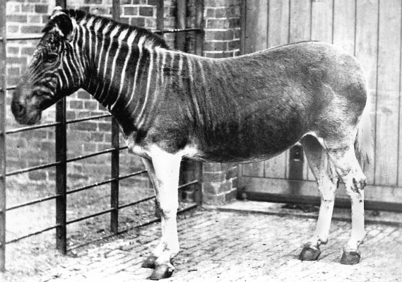

# Quagga

`quagga` is a command-line utility written in Rust that combines multiple text files into a single prompt suitable for Large Language Models (LLMs) like ChatGPT, Claude, or Perplexity. It automates the process of preparing a prompt from multiple text files in your coding project, so you don't need to locate those files manually and copy/paste them one by one into the LLM prompt.


## Installation

Download the `quagga` binary from the [releases page](https://github.com/evgenyneu/quagga/releases) and add it to your PATH.

## Usage

```
> quagga --help
Combine text files into a single LLM prompt.

Usage: quagga [OPTIONS] [DIRECTORY]

Arguments:
  [DIRECTORY]  The root directory to search for files [default: .]

Options:
  -i, --include <PATTERN>...      Include only file paths matching the glob patterns (e.g., src/*.js)
  -x, --exclude <PATTERN>...      Exclude file paths that match the glob patterns (e.g., node_modules)
  -C, --contain <TEXT>...         Include only files that contain the specified text
  -d, --max-depth <DEPTH>         Descend only DEPTH directories deep
  -f, --max-filesize <BYTES>      Ignore files above the specified size [default: 50000]
  -s, --max-total-size <BYTES>    Show error if total is over the specified size [default: 50000]
  -g, --no-gitignore              Don't use .gitignore files (used by default)
  -I, --no-quagga-ignore          Don't use .quagga_ignore from project and home dirs (used by default)
  -u, --gitignore-file <PATH>...  Path(s) to custom gitignore file(s)
  -B, --binary                    Don't ignore binary files (ignored by default)
  -H, --hidden                    Don't ignore hidden files (ignored by default)
  -l, --follow-links              Follow symbolic links (not followed by default)
  -t, --template <PATH>           Path to a custom template file
  -o, --output <PATH>             Output to a file instead of stdout
  -c, --clipboard                 Copy the output to the clipboard instead of stdout
  -D, --dry-run                   Show paths to files without combining them
  -p, --options <PATH>            Load options from a JSON file
  -v, --verbose                   Show detailed information during execution
  -h, --help                      Print help
  -V, --version                   Print version

Examples:
  Combine all Markdown files and copy the result to clipboard instead of stdout:
  > quagga --include '*.md' --clipboard

  Include only JavaScript, Typescript, and test files, excluding 'node_modules' and 'dist' directories:
  > quagga --include '*.{js,ts}' '*.test.*' --exclude node_modules dist

  Use a template to customize the prompt text:
  > quagga --template prompt.json --include '*.txt'

  Read options from a file:
  > quagga --options quagga_options.json

  Include only files that contain the words 'todo' or 'fixthis', look in '~/code/myapp' directory:
  > quagga --contain todo fixthis -- ~/code/myapp

  Use custom gitignore file:
  > quagga --gitignore-file /path/to/.custom.ignore

  Pipe file paths from another program:
  > find . -name '*.txt' | quagga

  Use a list of files from a text file:
  > cat file_list.txt | quagga
```

## Defaults

Quagga uses the following defaults that can be overridden with command-line options:

* Respects gitignore files (disable with `--no-gitignore`):
  * Standard: `.ignore`, `.gitignore`, `.git/info/exclude`.
  * Gitignore files from parent directories are respected.
  * Global ignore file from `core.excludesFile` option in `$HOME/.gitconfig` file. If not set, then `$XDG_CONFIG_HOME/git/ignore` is used. If `$XDG_CONFIG_HOME` is not set, then `$HOME/.config/git/ignore` is used.
  * Custom gitignore files can be set with the `--gitignore-file PATH` option.
* Uses `.quagga_ignore` files from the project and home directories written in the same format as gitignore (disable with `--no-quagga-ignore`).
* Ignores binary files (enable with `--binary`).
* Ignores hidden files (enable with `--hidden`).
* Ignores files larger than 50 KB (change with `--max-filesize BYTES`).
* Symbolic links are not followed (enable with `--follow-links`).

## What's Quagga?



*The quagga is an extinct subspecies of plains zebra that lived in South Africa until it was hunted to extinction in the late 19th century. This is the only known photograph of a living quagga, taken at the London Zoo in 1870 by Frederick York. Source: [Wikimedia Commons](https://en.wikipedia.org/wiki/Quagga#/media/File:Quagga_photo.jpg).*

## Development

See [docs/development.md](docs/development.md) for instructions on how to set up the development environment.


## Contributing

See contributing guidelines in [CONTRIBUTING.md](CONTRIBUTING.md).


## Alternative solutions

Here are some great programs from other developers that offer similar functionality:

* [simonw/files-to-prompt](https://github.com/simonw/files-to-prompt)
* [mufeedvh/code2prompt](https://github.com/mufeedvh/code2prompt)
* [banagale/FileKitty](https://github.com/banagale/FileKitty)


## Feedback is welcome

If you need help or notice a bug, feel free to create an issue ticket. We will be happy to help. :D


## License

Quagga is released under the [MIT License](LICENSE).
